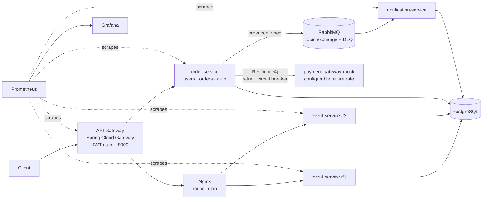

# Distributed Ticket Platform

A ticket-sales backend built as a set of Spring Boot microservices. The goal was to solve the problems that make ticketing hard in production: ​**overselling under concurrent load, double-charging on retries, and a payment provider that fails**​. Each of those has a mechanism and a reproducible demo below.

**Stack:** Java 17 · Spring Boot 4 · Spring Cloud Gateway · RabbitMQ · PostgreSQL · Resilience4j · Nginx · Prometheus · Grafana · Docker Compose

## Architecture



| Service                    | Responsibility                                                            |
| ---------------------------- | --------------------------------------------------------------------------- |
| `api-gateway`          | Single entry point, routing, JWT validation                               |
| `event-service`(×2)   | Event catalog and ticket inventory; runs as two instances behind Nginx    |
| `order-service`        | Users, authentication, order lifecycle, payment orchestration             |
| `payment-gateway-mock` | External payment provider stand-in with a runtime-adjustable failure rate |
| `notification-service` | Consumes`order.confirmed`events asynchronously                        |

## Engineering decisions

| Problem                | Mechanism                                                                                       | How to verify                                                         |
| ------------------------ | ------------------------------------------------------------------------------------------------- | ----------------------------------------------------------------------- |
| Overselling            | Atomic conditional`UPDATE`on inventory (no read-then-write race)                            | Second reservation on a quantity-1 event returns`409`             |
| Double charge on retry | Idempotency key at the gateway + primary-key guard in the consumer + order status guard         | Kill a service mid-payment: exactly one charge, one ticket, one email |
| Flaky payment provider | Resilience4j retry + circuit breaker                                                            | Set mock failure rate to 1.0 and watch the breaker open in the logs   |
| Lost messages          | RabbitMQ topic exchange with a dead-letter queue                                                | Failed notifications land in the DLQ instead of disappearing          |
| Horizontal scaling     | Two`event-service`instances behind Nginx                                                    | `/whoami`alternates between instances                             |
| Visibility             | Structured JSON logs, Micrometer → Prometheus → Grafana, custom`tickets_sold_total`metric | Grafana dashboard at`:3000`                                       |

## Run it

Requires Docker.

```bash
docker compose up --build
```

| URL                           | What                                              |
| ------------------------------- | --------------------------------------------------- |
| http://localhost:8000         | API Gateway (all application traffic)             |
| http://localhost:9090/targets | Prometheus (all targets should be UP)             |
| http://localhost:3000         | Grafana (`admin`/`admin`)                 |
| http://localhost:15672        | RabbitMQ management (`tickets`/`tickets`) |

## Demos

**Load balancing**

```bash
curl http://localhost:8000/whoami   # run twice, instance alternates
```

​**Oversell prevention**​: create an event with `availableQuantity: 1`, then reserve it twice. The second request must return `409 Conflict`.

**Circuit breaker**

```bash
# make the payment provider fail 100% of the time (admin port, not routed through the gateway)
curl -X POST http://localhost:8090/admin/mode -H "Content-Type: application/json" -d '{"failureRate":1.0}'
# attempt a payment and watch retries, then the breaker opening
docker compose logs -f order-service
# recover
curl -X POST http://localhost:8090/admin/mode -H "Content-Type: application/json" -d '{"failureRate":0.0}'
```

The full command reference, covering every endpoint, auth/role failure cases, idempotency, DLQ, and the error-code catalogue, is in ​**[Guide.md](/docs/Reference-Sheet.md)**​.

## Useful Grafana queries

```promql
rate(http_server_requests_seconds_count[1m])                                # throughput
histogram_quantile(0.95, rate(http_server_requests_seconds_bucket[1m]))     # p95 latency
rate(http_server_requests_seconds_count{status=~"5.."}[1m])                 # error rate
tickets_sold_total                                                           # business metric
```

## What I'd do next

* Automated integration tests with Testcontainers, including a concurrent-reservation test that proves the oversell guarantee
* Transactional outbox for `order.confirmed` so the DB write and the event publish can't diverge
* CI pipeline (GitHub Actions) building and testing every service

---

Built for the Distributed Systems course at UNISUL.

